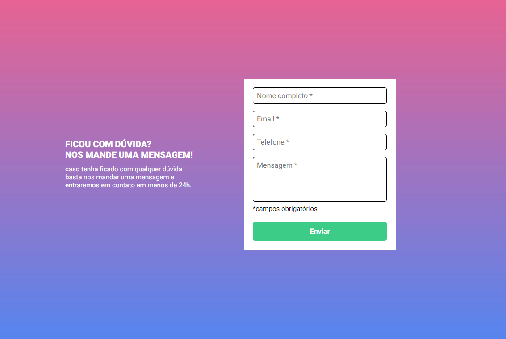

<h1 align ='center'>Simple Form Validation</h1>

    

  
Este projeto consiste em uma simples validação de formúlario usando somente JavaScript puro.

  

  
    
[Veja o Projeto](https://jhowbrcg.github.io/simple-form-validation/)
 

  

## Creator

| Author                                                                                                                                      |
| ------------------------------------------------------------------------------------------------------------------------------------------- |
| <a target="_blank" href="https://github.com/JhowBRCG"> </a> |
| &nbsp; &nbsp; &nbsp; Jhonathan                                                                                                              |
